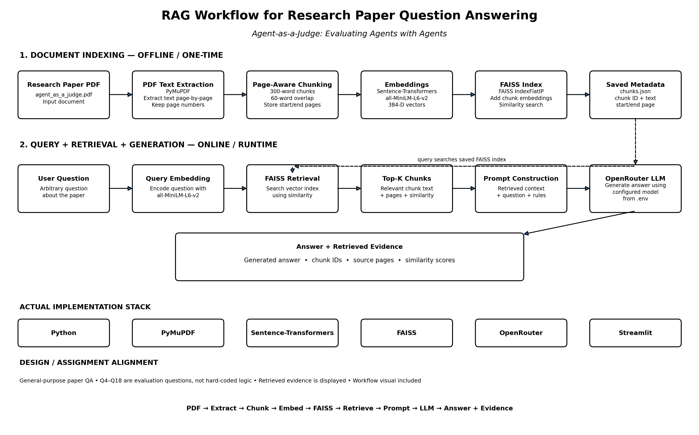

# Agent-as-a-Judge — Research Paper RAG

A retrieval-augmented generation (RAG) chatbot for question answering over the research paper:

**“Agent-as-a-Judge: Evaluating Agents with Agents”**

The system is designed as a **general-purpose paper QA system**, rather than a hard-coded solution to a fixed question set. A user can ask arbitrary questions about the paper, and the application retrieves relevant passages before generating an answer.

## Key Features

- Page-aware PDF text extraction using **PyMuPDF**
- Overlapping text chunking with source-page metadata
- Local semantic embeddings using **Sentence Transformers**
- Vector similarity search using **FAISS**
- LLM generation through **OpenRouter**
- Grounded answers based on retrieved paper context
- Retrieved evidence shown with:
  - chunk ID
  - source page(s)
  - similarity score
  - retrieved text
- Configurable Top-K retrieval
- Streamlit web interface
- No API key committed to the repository

## RAG Architecture



### Pipeline

```text
Research Paper PDF
        |
        v
PDF Text Extraction
        |
        v
Text Cleaning + Page Metadata
        |
        v
Overlapping Chunking
        |
        v
Sentence-Transformer Embeddings
(all-MiniLM-L6-v2)
        |
        v
FAISS Vector Index
        |
        |  Offline indexing complete
        |
        v
      User Question
        |
        v
   Query Embedding
        |
        v
 Similarity Retrieval
        |
        v
    Top-K Chunks
        |
        v
Prompt Construction
(Context + Question + Instructions)
        |
        v
   OpenRouter LLM
        |
        v
Answer + Retrieved Evidence
```

## Why This Design?

### 1. Retrieval before generation

The LLM is not given the complete paper blindly. The question is converted into an embedding and relevant chunks are retrieved from the FAISS index first.

This reduces the amount of irrelevant context passed to the generator and keeps the answer grounded in the paper.

### 2. Page-aware evidence

Each chunk retains its source page information. The UI therefore exposes where the retrieved evidence came from instead of returning an unsupported answer alone.

### 3. General-purpose QA

The implementation does not contain separate logic for the assignment's individual questions. The same retrieval and generation pipeline handles different questions about the paper.

### 4. Local embeddings + API-based generation

The embedding model runs locally, while generation uses an OpenRouter-compatible API. This keeps the local inference requirements small while still providing an LLM generation layer.

## Project Structure

```text
agent-as-a-judge-rag/
│
├── app.py
├── data/
│   └── agent_as_a_judge.pdf
│
├── docs/
│   └── rag_workflow.png
│
├── src/
│   ├── __init__.py
│   ├── pdf_loader.py
│   ├── chunker.py
│   ├── embedder.py
│   ├── vector_store.py
│   ├── retriever.py
│   ├── llm.py
│   ├── rag_pipeline.py
│   └── build_index.py
│
├── vector_store/
│   ├── faiss.index
│   └── chunks.json
│
├── .env.example
├── .gitignore
├── requirements.txt
└── README.md
```

## Installation

Create and activate a virtual environment:

```bash
python -m venv .venv
```

Windows:

```bash
.venv\Scripts\activate
```

Install dependencies:

```bash
pip install -r requirements.txt
```

## Environment Configuration

Create a `.env` file in the project root:

```env
OPENROUTER_API_KEY=my_api_key_here
OPENROUTER_MODEL=openrouter/free
```

The `.env` file is excluded from Git through `.gitignore`.

## Build the Vector Index

The index can be rebuilt from the source PDF with:

```bash
python -m src.build_index
```

This creates:

```text
vector_store/faiss.index
vector_store/chunks.json
```

The current indexing pipeline uses overlapping chunks and stores the associated page metadata with every chunk.

## Run the Application

Start the Streamlit application:

```bash
streamlit run app.py
```

The application provides:

1. A question input field
2. Configurable Top-K retrieval
3. A generated answer
4. Retrieved evidence
5. Source page information
6. Similarity scores

## Example Questions

The chatbot can answer questions such as:

```text
What is the DevAI dataset?
```

```text
How much time and cost does Agent-as-a-Judge save compared to Human-as-a-Judge?
```

```text
Which agentic frameworks were evaluated?
```

```text
What search algorithms were compared in the ablation study?
```

It is not restricted to these examples.

## Core Implementation

### `pdf_loader.py`

Extracts text from the research paper page-by-page while retaining page numbers.

### `chunker.py`

Creates overlapping word-based chunks and preserves the start and end page associated with each chunk.

### `embedder.py`

Uses:

```text
all-MiniLM-L6-v2
```

to convert text chunks and queries into semantic vector representations.

### `vector_store.py`

Uses FAISS `IndexFlatIP` for vector similarity search.

### `retriever.py`

Connects the query embedding process with FAISS and returns the most relevant chunks.

### `llm.py`

Builds a grounded prompt from the retrieved paper context and sends it to the configured OpenRouter model.

### `rag_pipeline.py`

Provides the main end-to-end interface:

```python
ask_question(question, top_k=5)
```

and returns:

```text
question
answer
sources
```

### `app.py`

Provides the Streamlit interface for interactive paper question answering.

## Grounding Strategy

The generation prompt instructs the model to:

- use only retrieved paper context
- preserve numerical values from the source
- avoid unsupported information
- state when the retrieved context is insufficient
- provide a concise research-paper answer

The retrieved evidence remains visible in the UI so that the generated response can be inspected against the source context.

## Limitations

- Retrieval quality depends on chunking and embedding similarity.
- Very broad or ambiguous questions may retrieve less relevant passages.
- The generation quality depends on the configured OpenRouter model.
- The system currently uses a single-document knowledge base.

## Reproducibility

The project separates the indexing and query-time stages:

```text
build_index.py
      |
      v
FAISS index + chunk metadata
      |
      v
Streamlit / RAG query pipeline
```

This avoids recomputing document embeddings for every user question.

## Assignment Deliverable

The repository contains the implemented RAG chatbot and the corresponding RAG workflow visualization required for the project assignment.

The workflow diagram is available at:

```text
docs/rag_workflow.png
```
